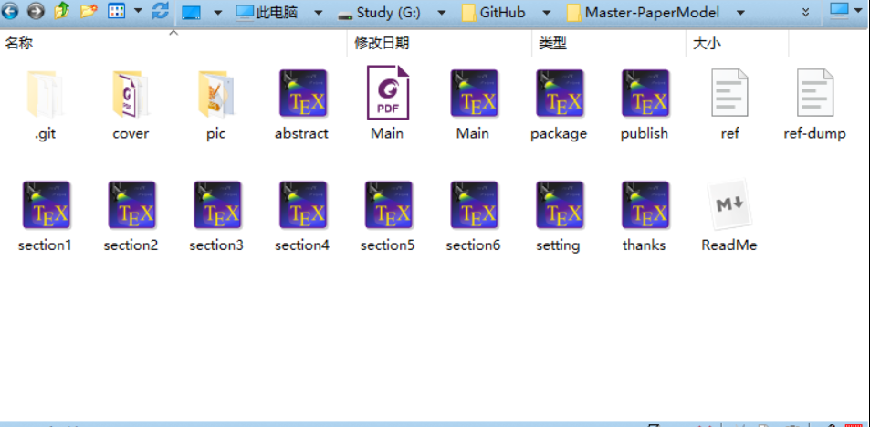

最近准备开始写毕业论文,Word非常不好用,所以干脆自己整理一下如何利用Latex来撰写毕业论文,主要是通过一系列的设置达到毕业论文的格式要求.

# 前言
因为有本科时候写毕业论文整理过的一个毕业论文模板,所以这里就是在这个模板的基础上进行的更加细致的修改,我打算在这里把如何修改每一个细节的代码都抽离出来,这样也方便自己之后如果有什么更改的需求,也可以很好的进行补充和调整.
# 摘要
首先是论文的摘要设置
```latex
%\setcounter{page}{1} \renewcommand{\thepage}{\wuhao\Roman{page}} % 页码设置
{\centering{\zihao{3}{\bf 论文题目}}\\}
\bigskip
{\zihao{-4}
	\begin{center}
		\begin{tabular}{l}
			专业名称：$\quad$专业名称$\quad\qquad$$\quad\qquad$$\quad$$\quad$$\quad$$\quad$$\quad$$\quad$\\
			申请者： $\quad\quad$姓名$\quad\qquad$$\quad\qquad$$\quad\qquad$\\
			导师姓名：$\quad$姓名\quad 职称$\quad\qquad$$\quad\qquad$$\quad\qquad$\\
		\end{tabular}
\end{center}}
\bigskip
\bigskip
\bigskip
{\flushleft{\zihao{-3}\heiti 摘\quad 要}}
\addcontentsline{toc}{section}{摘\quad 要}

%\setlength{\baselineskip}{26pt}
%\thispagestyle{empty}
\qquad 摘要内容\\
\quad\noindent{\zihao{-4}\heiti 关键词:}摘要关键字

\newpage
{\centering \zihao{-3}{\heiti Title of thesis}}
\bigskip
{\zihao{-3}
	\begin{center}
		\begin{tabular}{l}
			Major:$\quad\quad$Condensed Matter Physics$\quad\qquad$$\quad\qquad$\\
			Name:$\quad\quad$Name$\quad\qquad$$\quad\qquad$\\
			Supervisor: Name$\quad\qquad$\\
		\end{tabular}
\end{center}}
\bigskip
\bigskip
\bigskip

{\flushleft{\zihao{-3}\bf ABSTRACT}}

\addcontentsline{toc}{section}{ABSTRACT}
%\linespread{1.4}\zihao{-4}
%\thispagestyle{empty}%将本页的格式完全清除
\qquad English ABSTRACT\\
\noindent\textbf{\zihao{-4} Keywords:} English Keywords
```

通常论文的格式要求中,都需要目录中同时也要包括摘要所对应的页码,所以上面的代码中的
```latex
\addcontentsline{toc}{section}{摘\quad 要}
\addcontentsline{toc}{section}{ABSTRACT}
```
这两行的作用就是分别将中文摘要和英文摘要对应的页码位置也追加到目录中.

字体的大小调节就直接使用`\zihao{number}`来设置,如果是四号就用`\zihao{4}`,如果是小四号就用`\zihao{-4}`,字体如果要加黑有两种方式`{\heiti 加黑字体}`或者使用`{\bf 加黑字体}`.

# 参考文献,致谢,已发表论文
参考文献,致谢,已发表论文这三项出现在论文的最后,也要追加到目录中,但是不能以章节的形式,所以处理方式如下
## 参考文献
```latex
\newpage
\addcontentsline{toc}{section}{参考文献} %向目录中添加条目，以章的名义
%\bibliographystyle{IEEEtran} % 参考文献样式
\bibliographystyle{elsarticle-num} % 大致可以
\bibliography{ref} %加入参考文献
```
这里`\bibliography{ref}`就是使用latex类型的文献导出格式
## 致谢及已发表论文
```latex
\newpage
\addcontentsline{toc}{section}{致谢} %向目录中添加条目，以章的名义
\input{thanks}  % 致谢
\addcontentsline{toc}{section}{作者攻读学位期间发表的学术论文} %向目录中添加条目，以章的名义
\input{publish}  % 论文发表
```
将致谢与已发表论文分开写到单独的文件内,然后使用`\input{file}`包含到主文件中,这样做的好处是修改特定部分的时候可以分开处理,文件内容看起来就不会特别多,对于文字量较大的活来说,这样做是比较方便的.

```latex
\newpage
\centering{\zihao{3}\heiti 致谢}
\bigskip
致谢内容。
```

```latex
\newpage
\centering{\zihao{3}\bf 作者攻读学位期间发表的学术论文}
\flushleft{\zihao{4}\bf 发表的学术论文}

\begin{itemize}
	\item {\bf Yu-Xuan Li} and Tao Zhou$^{*}$,Rotational symmetry breaking and partial Majorana corner states in a heterostructure
	based on high-T$_c$ superconductors,Physical Review B 103, 024517 (2021)
\end{itemize}

\begin{enumerate}
	\item {\bf Yu-Xuan Li} and Tao Zhou$^{*}$,Rotational symmetry breaking and partial Majorana corner states in a heterostructure
	based on high-T$_c$ superconductors,Physical Review B 103, 024517 (2021)
\end{enumerate}
```
这里已发表论文的样式可以选择不同的样式.

# 文章主体文件
上面介绍的就是主要文章的结构,把它们都组织起来就可以构成一个完整的硕士学位论文的框架,主要代码如下
```latex
\documentclass[12pt,a4paper]{ctexart}%A4纸张,ctexart为文章类型，改格式支持中文
\input{package}%宏包导入
\input{setting}%文章整体格式与布局设置
%==================   正文  ======================================
\begin{document}
\songti
%作者信息与论文信息
\clearpage
\author{YuXuan-Li}
\title{硕士毕业论文初稿}
\date{\today}
\maketitle
%毕业论文封面
%\includepdf{cover/cover.pdf}

%======================页码设置
% empty - 没有页眉和页脚
% plain - 没有页眉，页脚包含一个居中的页码
% headings - 没有页脚，页眉包含章/节或者字节的名字和页码
% myheadings - 没有页脚，页眉包含有页码
\pagestyle{plain}
\setcounter{page}{1}%当前页为第一页
\pagenumbering{Roman}
% arabic - 阿拉伯数字
% roman - 小写的罗马数字
% Roman - 大写的罗马数字
% alph - 小写的字符形式
% Alph -大写的字符形式
%======================================================================
%\makeatother %生成目录
%\addcontentsline{toc}{chapter}{\contentsname}
%\tableofcontents%增加章节目录

%\newpage%另起一页
%\listoftables%增加表格目录

%\newpage
%\listoffigures%增加图片目录
%=================摘要==================
\newpage
\input{abstract}
\newpage
\tableofcontents%增加章节目录
%================正文=======================
\newpage
\input{section1}
\newpage
\input{section2}
\newpage
\input{section3}
\newpage
\input{section4}
\newpage
\input{section5}
\newpage
\input{section6}
%==============================================================================
\newpage
\addcontentsline{toc}{section}{参考文献} %向目录中添加条目，以章的名义
%\bibliographystyle{IEEEtran} % 参考文献样式
\bibliographystyle{elsarticle-num} % 大致可以
\bibliography{ref}%加入参考文献
%==============================================
\newpage
\addcontentsline{toc}{section}{致谢} %向目录中添加条目，以章的名义
\input{thanks}  % 致谢
\addcontentsline{toc}{section}{参考文献} %向目录中添加条目，以章的名义
\input{publish}  % 论文发表
\end{document}
```

在这里我仍然将所有的章节分开到不同的`.tex`文件中,如果之后要进行修改,只需要对单独的文件修改整理即可,这样就不会因为文件内容较大,不太容易处理.到此就是整个模板的主题内容，接下来主要来介绍一下模板中具体的样式是如何设置的.


# 样式设置
这里来整理一下如何对具体的样式进行调整。我将宏包引入与样式调节分成了两个文件'package.tex','setting.tex',这样做的目的就是为了方便调整.

## package.tex
```latex
%\usepackage[top=30mm,bottom=25mm,left=25mm,right=25mm]{geometry}%页面布局
\usepackage[top=2cm,bottom=3cm,left=3cm,right=3cm,includehead,includefoot]{geometry} %文档排版结构设置
\usepackage{graphicx}%图片载入
\usepackage{float}%图片浮动环境，类似于word中的文字浮动和图片的关系
\usepackage{amsmath}%数学环境
%\usepackage{epstopdf}% eps格式图片使用宏包
\usepackage{pdfpages}% 直接插入pdf的宏包
\usepackage{ulem}
%\usepackage{url}%超链接
%\usepackage{identfirst}
\usepackage{setspace}%行间距设置宏包
%\usepackage{marginnote}% 边注宏包
%\usepackage{subfigure}
%\usepackage{subfig}
%\usepackage{diagbox}
%\usepackage{appendix}%增加附录
\usepackage{fancyhdr}% 设置页眉和页脚宏包
%\usepackage{xcolor}% 边框设置宏包
%\usepackage{listings}% 边框样式设置
\usepackage{titlesec}% 标题与段落间距
\usepackage{titletoc} % 目录设置
\usepackage{xeCJK} %字体设置
%\usepackage[numbers,compress]{natbib} % 文献引用设置
\usepackage[colorlinks,linkcolor=blue,anchorcolor=blue,citecolor=blue]{hyperref}  % 公式,文献引用设置超链接
\usepackage{cite} % 参考文献引用设置
```

这一部分内容没有什么需要解释的,具体每一个宏包是应用到哪里的我在里面都做了具体的注释,唯一需要说明的就是我的软件安装问题.我这里使用的是`texlive+texstudio`,如果安装了完整版的`texlive`的话,这些宏包应该都是有的,我没有单独安装过其他别的宏包.

## setting.tex
```latex
%\linespread{1.6}%行间距设置
\numberwithin{equation}{section}  %公式按照章节标号
\renewcommand\thefigure{\thesection.\arabic{figure}}  %图片按章节标号
\makeatletter
\@addtoreset{figure}{section} % 制作图片目录
\renewcommand{\figurename}{图}               % 对图表中的Fig进行中文翻译变为图,比如(fig1--->图1)
\renewcommand{\contentsname}{目$\qquad$录}           % 对Contents进行汉化为目录 
\renewcommand\listfigurename{插\ 图\ 目\ 录} % 对List of Figures进行汉化为插图目录
\renewcommand\listtablename{表\ 格\ 目\ 录}  % 对List of Tables进行汉化表格目录
\setcounter{tocdepth}{2}	%目录章节深度设置(2表示只显示到\subsection)

%\setlength{\parskip}{0.5\baselineskip}	% 设置空行换行后，上下两段文字间距
%\titlespacing*{section}{0pt}{9pt}{0pt}	% 设置标题与段落间距
%============================= 目录设置 ======================
\titlecontents{chapter}[1.5em]{\zihao{3}\bf }{\contentslabel{1.5em}}{\hspace*{-2em}}{\titlerule*[5pt]{$\cdot$}\contentspage}
\titlecontents{section}[3.3em]{\zihao{-3}\bf }{\contentslabel{1.8em}}{\hspace*{-2.3em}}{\titlerule*[5pt]{$\cdot$}\contentspage}
\titlecontents{subsection}[2.5em]{\zihao{3}}{\thecontentslabel{$\quad$}}{}{\titlerule*[5pt]{$\cdot$}\contentspage}
%==========================================================================
\renewcommand{\baselinestretch}{1.5} 	%行间距1.5倍
%===============================页眉页脚设置================================
\fancypagestyle{plain}{
%\fancyhead[RE]{\leftmark} 	% 在偶数页的右侧显示章名
\fancyhf{}
%\fancyhead[C]{\rightmark} 	% 页眉居中显示章节名
\fancyhead[C]{高温超导异质结中的旋转对称破缺和部分马约拉纳角态} %页眉居中设置论文标题
\fancyfoot[C]{第\thepage 页}  % 在页脚中间显示 第几页
%\fancyhead[LO]{\rightmark}		% 在奇数页的左侧显示小节名
%\fancyhead[LE,RO]{~\thepage~}	% 在偶数页的左侧，奇数页的右侧显示页码
% 设置页脚：在每页的右下脚以斜体显示书名
%\fancyfoot[RO,RE]{\it \text{右下角内容}} %右下角增加\text{}中的内容
\renewcommand{\headrulewidth}{1.5pt}  % 页眉与正文之间的水平线粗细
\renewcommand{\footrulewidth}{1.5pt}  % 页脚也正文之间的水平黑线
%\renewcommand{\footrulewidth}{0pt}
%\renewcommand\headrule{\hrule width \hsize height 2pt \kern 2pt \hrule width \hsize height 0.4pt}%页眉上双线
}
%=============== 全局字体设置 ===============
\renewcommand{\songti}{\CJKfontspec{STSong}} % 华文宋体(设置字体的别称,这样就可以在正文中使用)
%===============================  引用上标设置 ===========
\makeatletter
\def\@cite#1#2{\textsuperscript{[{#1\if@tempswa , #2\fi}]}}  % 设置文献引用,并让其上标显示
\makeatother
%  下面是第二种文献上标引用的方式,但是在使用这个方式的时候,需要使用package.tex中的(\usepackage[numbers,compress]{natbib})
%   这个宏包,但是我觉得还是使用上面的文献引用方式比较好
%\newcommand{\upcite}[1]{\textsuperscript{\textsuperscript{\cite{#1}}}} %之后的文献上标引用使用\upcite{}
%\newcommand{\upcite}[1]{$^\cite{#1}$} %之后的文献上标引用使用\upcite{}
%============================ 设置自己的简短命令 ===========================================================
```
每一行设置的作用我都在上面写上了详细的解释,看起来可能会晕头晕脑,想要明白每一项的作用,还是需要将整个项目进行编译,然后通过对上面参数的调整来观察文档的变化.

上面的命令中,有一项需要说明你一下,因为这里使用的是`\documentclass[12pt,a4paper]{ctexart}%A4纸张,ctexart为文章类型，改格式支持中文`这种支持中文环境的模板,所以这里的字体大小设置就直接使用`\zihao{num}`这个命令来声明字体大小,比如相设置4号字体就使用`\zihao{4}`,如果是小四号字体就使用`\zihao{-4}`.而且在使用`ctexart`这个支持中文环境的模板,所以编译的时候需要使用`XeLatex`这个编译选项.


# 总结
以上就是整个模板的所有内容,具体的文件内容如下图所示  




**这里致谢一下谢文欣同学,这个事情是他想搞的,我在他提供的一个Latex文件的基础上完成了对整体样式的调整,感谢他在我更改这个模板中提出的问题和建议.**


